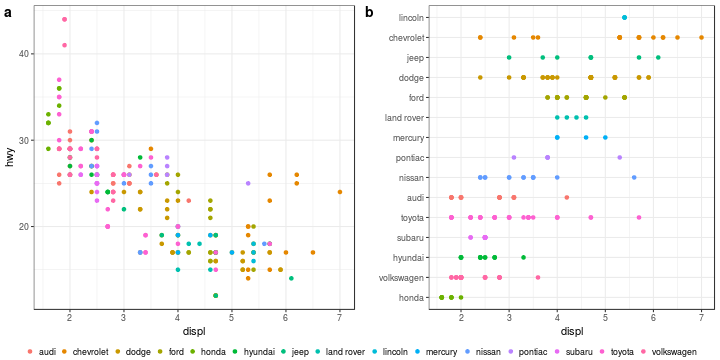
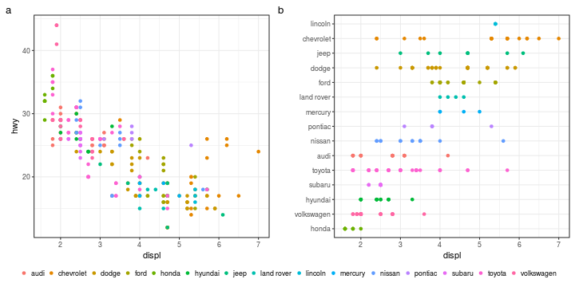
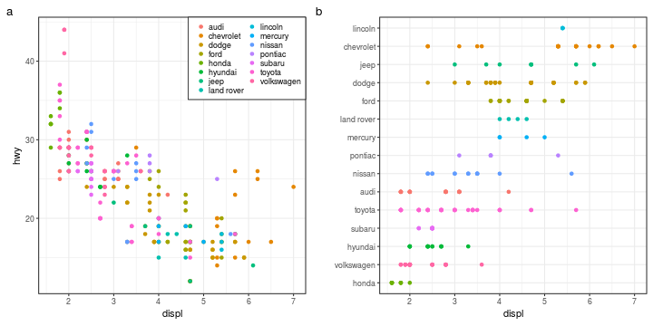

# Composite plots

Create [composite_plots.md](composite_plots.md): `R -e 'library(knitr); knit("composite_plots.Rmd")'`

Required libraries:

```r
library(tidyverse)
```

## Two sub-plots with labels and shared legend
Make two plots that should be shown side by side and have a common legend below.
Initially, we remove the legend only from the second plot.


```r
p1 <- ggplot(mpg) +
  geom_point(aes(x=displ,y=hwy,color=manufacturer)) +
  theme_bw() +
  theme(legend.position="bottom", legend.title=element_blank()) +
  guides(color=guide_legend(nrow=1))

p2 <- ggplot(mpg) +
  geom_point(aes(y=fct_reorder(manufacturer,displ,fun=mean),x=displ,color=manufacturer)) +
  theme_bw() + 
  theme(legend.position="none") +
  ylab("")
```

### With cowplot
One approach is to use the plot_grid function of [cowplot](https://cran.r-project.org/web/packages/cowplot/index.html) twice, first for aligning both plots and then adding the legend:

```r
library(cowplot)
panels <- plot_grid(p1+theme(legend.position="none"), p2, labels="auto", align = 'h')
plot_grid(panels,get_legend(p1), ncol=1, rel_heights = c(1, .05))
```



### With patchwork
Another approach is the [patchwork](https://github.com/thomasp85/patchwork) package:

```r
#install.packages("devtools")
#devtools::install_github("thomasp85/patchwork")
library(patchwork)
p1 + theme(legend.position="none") + labs(tag="a") +
  p2 + labs(tag="b") + plot_annotation(tag_levels ="a") -
  get_legend(p1) + plot_layout(heights = c(20,1), ncol=1)
```



### Inset legend
Another alternative could be an inset legend:

```r
p1 <- ggplot(mpg) +
  geom_point(aes(x=displ,y=hwy,color=manufacturer)) +
  theme_bw() +
  theme(legend.justification=c(1,1),
        legend.position=c(1,1),
        legend.title=element_blank(),
        legend.background=element_blank(),
        legend.box.background=element_rect(colour="black"),
        legend.key.height = unit(10, 'pt')) +
  guides(color=guide_legend(ncol=2))

p1 + labs(tag="a") + p2 + labs(tag="b") + plot_annotation(tag_levels ="a")
```


