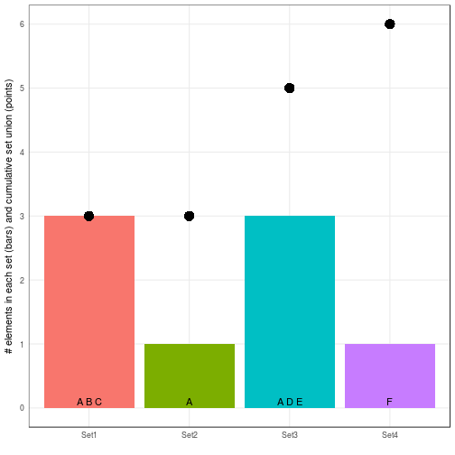

# Cumulative count of set union

Create [cumulative_sets_bars.md](cumulative_sets_bars.md): `R -e 'library(knitr); knit("cumulative_sets_bars.Rmd")'`

Required libraries:

```r
library(plyr)
library(dplyr)
library(ggplot2)
```

## Basic case

Create data frame with two columns for set IDs and elements:


```r
element <- c("A","B","C","A","A","D","E","F")
id <- c("Set1", "Set1", "Set1", "Set3", "Set2", "Set3","Set3","Set4")
df <- data.frame(id, element)
df
```

```
##     id element
## 1 Set1       A
## 2 Set1       B
## 3 Set1       C
## 4 Set3       A
## 5 Set2       A
## 6 Set3       D
## 7 Set3       E
## 8 Set4       F
```

Order by set id and increase counter for each additional element to generate a cumulative count of unique elements:


```r
df.cc <- mutate(df[order(df$id),],cc=cumsum(!duplicated(unlist(element))))
df.cc
```

```
##     id element cc
## 1 Set1       A  1
## 2 Set1       B  2
## 3 Set1       C  3
## 4 Set2       A  3
## 5 Set3       A  3
## 6 Set3       D  4
## 7 Set3       E  5
## 8 Set4       F  6
```

Now, collapse the data frame by `id` and assign highest value of `cc` to the new column `ccmax`.
Additionally, add a count for the number of elements in each set and a string with all element names.


```r
df.cc.max <- ddply(df.cc, .(id), summarise, n_elements=length(element), ccmax=max(cc), elements=paste(element,collapse=" "))
df.cc.max
```

```
##     id n_elements ccmax elements
## 1 Set1          3     3    A B C
## 2 Set2          1     3        A
## 3 Set3          3     5    A D E
## 4 Set4          1     6        F
```

Plot bar chart with set sizes and cumulative sum of set union size (`ccmax`):

```r
ggplot(df.cc.max,aes(x=id,fill=id)) +
  geom_bar(aes(y=n_elements),stat="identity") +
  geom_point(aes(y=ccmax, fill=id),shape=16,size=5) +
  geom_text(y=0.1,aes(label=elements)) +
  theme_bw() + theme(legend.position="none",axis.ticks=element_blank(),panel.grid.minor.y=element_blank()) +
  xlab("") +
  scale_y_continuous("# elements in each set (bars) and cumulative set union (points)",breaks=seq(0,6,1),labels=(seq(0,6,1)))
```



## Subsets
Assign probability to each element:

```r
element <- c("A","B","C","A","A","D","E","F")
prob <- c(0.3, 0.8 , 1.0, 0.9, 0.7, 1.0, 0.2, 0.8)
id <- c("Set1", "Set1", "Set1", "Set3", "Set2", "Set3","Set3","Set4")
df <- data.frame(id, prob, element)
df
```

```
##     id prob element
## 1 Set1  0.3       A
## 2 Set1  0.8       B
## 3 Set1  1.0       C
## 4 Set3  0.9       A
## 5 Set2  0.7       A
## 6 Set3  1.0       D
## 7 Set3  0.2       E
## 8 Set4  0.8       F
```
Only count elements with `prob > 0.5`:


```r
df.cc <- mutate(subset(df[order(df$id),],prob>0.5),cc=cumsum(!duplicated(unlist(element))))
df.cc
```

```
##     id prob element cc
## 1 Set1  0.8       B  1
## 2 Set1  1.0       C  2
## 3 Set2  0.7       A  3
## 4 Set3  0.9       A  3
## 5 Set3  1.0       D  4
## 6 Set4  0.8       F  5
```

