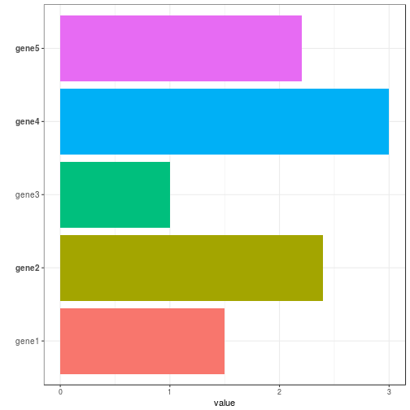

# Cumulative count of set union

Create [ggplot_mixed_axis_text_styles.md](ggplot_mixed_axis_text_styles.md): `R -e 'library(knitr); knit("ggplot_mixed_axis_text_styles.Rmd")'`

This recipe shows how to print some discrete axis texts in bold font, depending on a factor.
It uses the `colorado()` function from [here](https://stackoverflow.com/questions/39694490/highlighting-individual-axis-labels-in-bold-using-ggplot2).

Required libraries:

```r
library(ggplot2)
library(tidyr)
```

Define `colorado` function:

```r
colorado <- function(src, boulder) {
  if (!is.factor(src)) src <- factor(src)                   # make sure it's a factor
  src_levels <- levels(src)                                 # retrieve the levels in their order
  brave <- boulder %in% src_levels                          # make sure everything we want to make bold is actually in the factor levels
  if (all(brave)) {                                         # if so
    b_pos <- purrr::map_int(boulder, ~which(.==src_levels)) # then find out where they are
    b_vec <- rep("plain", length(src_levels))               # make'm all plain first
    b_vec[b_pos] <- "bold"                                  # make our targets bold
    b_vec                                                   # return the new vector
  } else {
    stop("All elements of 'boulder' must be in src")
  }
}
```

Create data frame for example:

```r
name <- c("gene1","gene2","gene3","gene4","gene5")
value <- c(1.5,2.4,1.0,3.0,2.2)
df <- data.frame(name,value)
df
```

```
##    name value
## 1 gene1   1.5
## 2 gene2   2.4
## 3 gene3   1.0
## 4 gene4   3.0
## 5 gene5   2.2
```

Make list of names with values higher than 2.0

```r
bold_genes <- unique(as.vector(subset(df,value>=2.0)$name))
```


```r
ggplot(df) +
	geom_col(aes(x=name,y=value,fill=name)) +
	theme_bw() +
	theme(axis.text.y=element_text(face=colorado(df$name, bold_genes),size=10)) +
	scale_fill_discrete(guide=F) +
	xlab("") +
	coord_flip()
```




