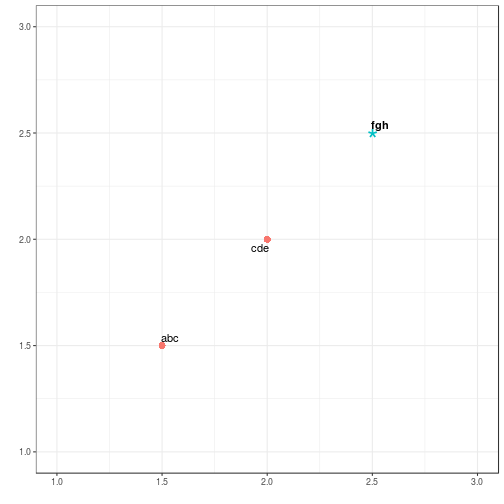

# Cumulative count of set union

Create [ggplot_mixed_fontstyles.md](ggplot_mixed_fontstyles.md): `R -e 'library(knitr); knit("ggplot_mixed_fontstyles.Rmd")'`

Required libraries:

```r
library(ggplot2)
library(ggrepel)
```

## Basic case

Create data frame:

```r
name <- c("abc","cde","fgh")
x <- c(1.5,2,2.5)
y <- c(1.5,2,2.5)
df <- data.frame(name,x,y)
df
```

```
##   name   x   y
## 1  abc 1.5 1.5
## 2  cde 2.0 2.0
## 3  fgh 2.5 2.5
```

Add column for fonttype using a y-value cutoff:

```r
df$fonttype <- ifelse(y > 2.0, "bold", "plain")
df$abovethreshold <- ifelse(y > 2.0, TRUE, FALSE)
```


```r
ggplot(df,aes(x=x, y=y)) +
  geom_point(aes(shape=abovethreshold,size=abovethreshold,color=abovethreshold)) +
  geom_text_repel(aes(label=name,fontface=fonttype)) +
  theme_bw() +
  scale_shape_manual(guide=F,values=c(16,42)) +
  scale_size_manual(guide=F,values=c(3,8)) +
  scale_color_discrete(guide=F)+
  xlab("") +
  ylab("") +
  xlim(1,3) +
  ylim(1,3)
```




