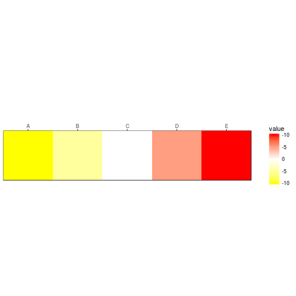

# Manipulate guide axis text

Create [manipulate_guide_axis_text.md](manipulate_guide_axis_text.md): `R -e 'library(knitr); knit("manipulate_guide_axis_text.Rmd")'`

Required libraries:

```r
library(ggplot2)
```

## Basic case

Create data frame:


```r
element <- c("A","B","C","D","E")
value <- c(-10,-5,0,5,10)
df <- data.frame(element,value)
df
```

```
##   element value
## 1       A   -10
## 2       B    -5
## 3       C     0
## 4       D     5
## 5       E    10
```


Plot as tile chart and alter labels in the legend to be negative by applying a function that modifies each label:


```r
ggplot(df) +
	geom_tile(aes(x=element,y=1,fill=value)) +
	theme_bw() +
	scale_x_discrete(position="top",expand=c(0,0)) +
	scale_y_discrete(position="right",expand=c(0,0)) +
	scale_fill_gradient2(high="red",low="yellow",mid="white",labels=function(x){-1*abs(x)}) +
	xlab("") +
	ylab("") +
	coord_fixed()
```



