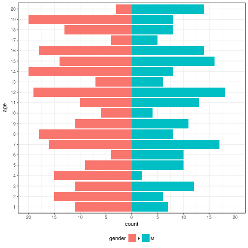

#test Cumulative count of set union

Create [population_pyramid_bars.md](population_pyramid_bars.md): `R -e 'library(knitr); knit("population_pyramid_bars.Rmd")'`

Required libraries:

```r
library(plyr)
library(dplyr)
library(ggplot2)
```

## Basic case

Create data frame with columns for age group, gender, and count:

```r
set.seed(100)
df <- data.frame(count=sample(1:20,20), gender=c(rep('M',10),rep('F',10)), group=factor(rep(1:10,2)))
df
```

```
##    count gender group
## 1      7      M     1
## 2      5      M     2
## 3     10      M     3
## 4      1      M     4
## 5      8      M     5
## 6     16      M     6
## 7     12      M     7
## 8     19      M     8
## 9     20      M     9
## 10     2      M    10
## 11    14      F     1
## 12    15      F     2
## 13     3      F     3
## 14     9      F     4
## 15    13      F     5
## 16     4      F     6
## 17    17      F     7
## 18    11      F     8
## 19     6      F     9
## 20    18      F    10
```

The trick for making bi-directional bars is to convert the counts of one gender to negative values and change the axis labels to postive values on both sides:

```r
ggplot(data=df,aes(x=group, fill=gender)) +
  geom_bar(data=subset(df,gender=='M'),aes(y=count),stat="identity") +
  geom_bar(data=subset(df,gender=='F'),aes(y=-1*count),stat="identity") +
  coord_flip() +
  theme_bw() +
  theme(legend.position="none") +
  scale_y_continuous(limits=c(-20,20),breaks=seq(-20,20,5),labels=abs(seq(-20,20,5)))
```



